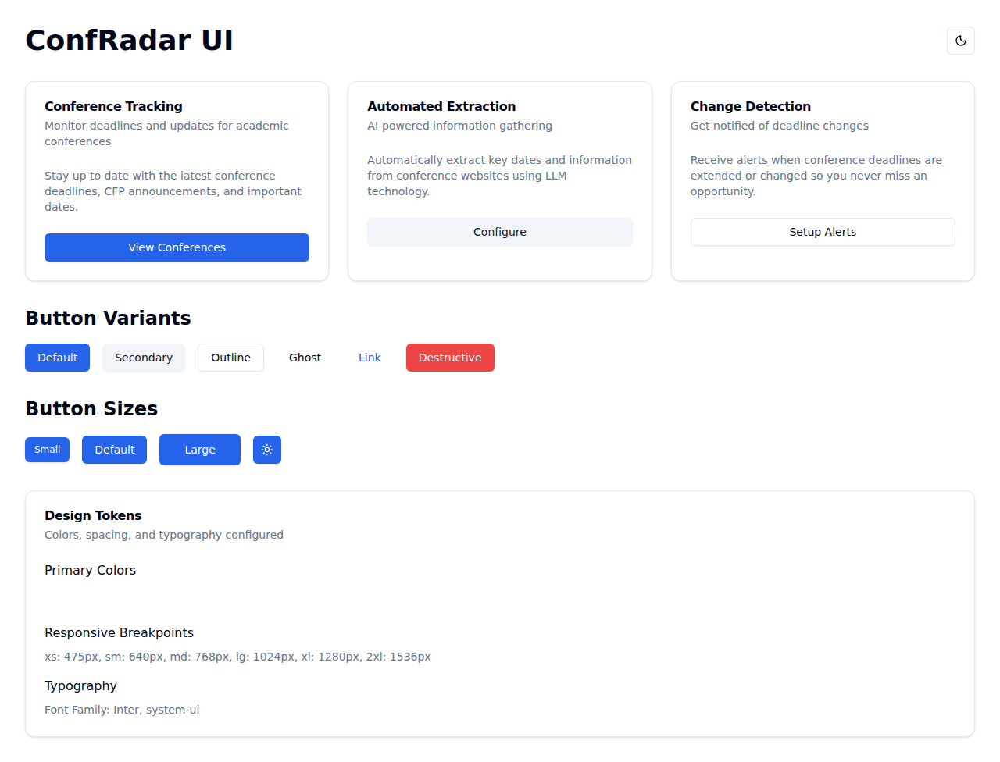
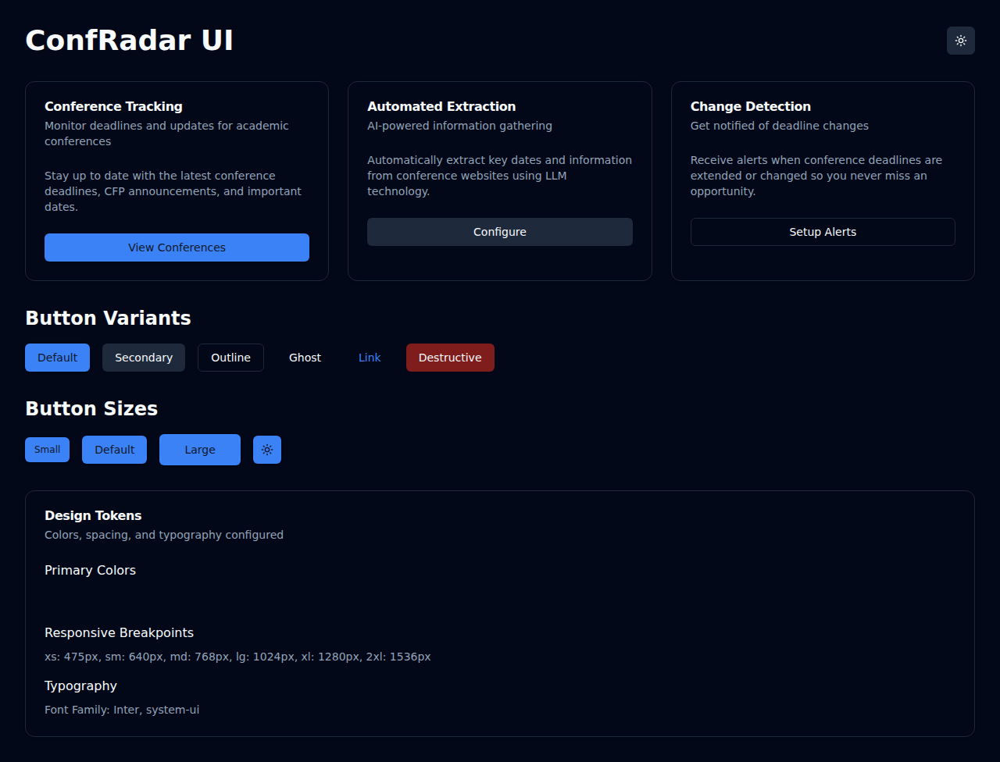

# Frontend UI Component Library and Styling System Setup

## Overview

This document describes the UI component library and styling system setup for the ConfRadar frontend application.

## Technology Stack Selection

After evaluating the options presented in the issue (Tailwind CSS, Material-UI, Ant Design, Chakra UI, shadcn/ui), we selected:

- **Tailwind CSS** - Utility-first CSS framework for flexible, maintainable styling
- **shadcn/ui** - Modern React component library built on Radix UI primitives

### Rationale

1. **Tailwind CSS**: Provides excellent developer experience with utility classes, small bundle sizes, and complete control over styling without fighting framework opinions
2. **shadcn/ui**: Offers high-quality, accessible components that are:
   - Copy-paste friendly (components live in your codebase)
   - Fully customizable with Tailwind
   - Built on Radix UI for accessibility
   - Type-safe with TypeScript
   - Modern and actively maintained

This combination provides the best balance of:
- Developer productivity
- Design flexibility
- Code ownership
- Performance
- Accessibility
- Modern React patterns

## Implementation Details

### Project Structure

```
packages/frontend/
├── src/
│   ├── components/
│   │   ├── ui/                    # shadcn/ui components
│   │   │   ├── button.tsx
│   │   │   └── card.tsx
│   │   └── theme-provider.tsx     # Theme management
│   ├── lib/
│   │   └── utils.ts               # Utility functions (cn)
│   ├── App.tsx                    # Demo application
│   ├── main.tsx                   # Entry point
│   └── index.css                  # Global styles + Tailwind directives
├── public/                        # Static assets
├── tailwind.config.js             # Tailwind configuration
├── postcss.config.js              # PostCSS configuration
├── vite.config.ts                 # Vite build configuration
├── tsconfig.json                  # TypeScript configuration
├── package.json                   # Dependencies
└── README.md                      # Frontend documentation
```

### Design Tokens

#### Colors

**Primary Scale (Blue)**
- Used for main brand colors, primary actions, and interactive elements
- Range: primary-50 (lightest) to primary-950 (darkest)
- Default: primary-500 (#3b82f6)

**Secondary Scale (Slate)**
- Used for neutral UI elements, text, and backgrounds
- Range: secondary-50 (lightest) to secondary-950 (darkest)
- Default: secondary-500 (#64748b)

**Semantic Colors (CSS Variables)**
These adapt automatically for light and dark modes:
- `background` / `foreground` - Page background and default text
- `card` / `card-foreground` - Card components
- `popover` / `popover-foreground` - Dropdown/popover components
- `primary` / `primary-foreground` - Primary brand colors
- `secondary` / `secondary-foreground` - Secondary UI elements
- `muted` / `muted-foreground` - Muted/subtle elements
- `accent` / `accent-foreground` - Accent/highlight elements
- `destructive` / `destructive-foreground` - Error/danger states
- `border` - Border colors
- `input` - Input field borders
- `ring` - Focus ring colors

#### Typography

**Font Families:**
- **Sans-serif**: Inter, system-ui, Avenir, Helvetica, Arial, sans-serif
- **Monospace**: Fira Code, monospace

**Usage:**
```tsx
<p className="font-sans">Regular text</p>
<code className="font-mono">Code snippet</code>
```

#### Spacing

Standard Tailwind spacing scale (0.25rem increments) plus custom utilities:
- `128` = 32rem (512px)
- `144` = 36rem (576px)

**Usage:**
```tsx
<div className="p-4 mt-8 space-y-128">
  {/* Content */}
</div>
```

#### Border Radius

Controlled via CSS variable `--radius` (default: 0.5rem):
- `rounded-lg` = var(--radius)
- `rounded-md` = calc(var(--radius) - 2px)
- `rounded-sm` = calc(var(--radius) - 4px)

### Responsive Breakpoints

| Breakpoint | Size | Use Case |
|------------|------|----------|
| xs | 475px | Extra small devices |
| sm | 640px | Small devices (phones) |
| md | 768px | Medium devices (tablets) |
| lg | 1024px | Large devices (laptops) |
| xl | 1280px | Extra large devices (desktops) |
| 2xl | 1536px | Extra extra large devices |

**Usage Example:**
```tsx
<div className="grid grid-cols-1 md:grid-cols-2 lg:grid-cols-3">
  {/* Responsive grid: 1 column on mobile, 2 on tablet, 3 on desktop */}
</div>
```

### Theme Provider

The application includes a complete theming system with light and dark modes.

**Setup:**
```tsx
import { ThemeProvider } from '@/components/theme-provider'

<ThemeProvider defaultTheme="light" storageKey="confradar-ui-theme">
  <App />
</ThemeProvider>
```

**Usage:**
```tsx
import { useTheme } from '@/components/theme-provider'

function ThemeToggle() {
  const { theme, setTheme } = useTheme()
  
  return (
    <button onClick={() => setTheme(theme === "light" ? "dark" : "light")}>
      Toggle theme
    </button>
  )
}
```

**Features:**
- Persists theme preference in localStorage
- Supports system preference detection
- Smooth transitions between themes
- CSS variable-based color system

### UI Components

#### Button Component

Variants:
- `default` - Primary action button
- `secondary` - Secondary action button
- `outline` - Outlined button
- `ghost` - Transparent button
- `link` - Link-styled button
- `destructive` - Danger/delete actions

Sizes:
- `sm` - Small button
- `default` - Standard button
- `lg` - Large button
- `icon` - Icon-only button

**Example:**
```tsx
import { Button } from '@/components/ui/button'

<Button variant="default" size="lg">
  Click me
</Button>
```

#### Card Component

Composable card with semantic sub-components:
- `Card` - Container
- `CardHeader` - Header section
- `CardTitle` - Title text
- `CardDescription` - Subtitle/description
- `CardContent` - Main content
- `CardFooter` - Footer section with actions

**Example:**
```tsx
import {
  Card,
  CardContent,
  CardDescription,
  CardFooter,
  CardHeader,
  CardTitle,
} from '@/components/ui/card'
import { Button } from '@/components/ui/button'

<Card>
  <CardHeader>
    <CardTitle>Conference Tracking</CardTitle>
    <CardDescription>Monitor deadlines and updates</CardDescription>
  </CardHeader>
  <CardContent>
    <p>Stay up to date with conference deadlines.</p>
  </CardContent>
  <CardFooter>
    <Button>View Conferences</Button>
  </CardFooter>
</Card>
```

### Utility Functions

#### cn() - Class Name Utility

Intelligently merges Tailwind classes using `clsx` and `tailwind-merge`:

```tsx
import { cn } from '@/lib/utils'

// Conditional classes
<div className={cn(
  "base-class",
  isActive && "active-class",
  className // Accept external className prop
)} />

// Tailwind class conflicts resolved automatically
cn("px-2 py-1", "px-3") // Result: "py-1 px-3"
```

## Screenshots

### Light Mode


### Dark Mode


## Development Workflow

### Running the Dev Server

```bash
cd packages/frontend
npm run dev
```

Visit http://localhost:5173/ to see the demo application.

### Building for Production

```bash
npm run build
```

Outputs optimized production files to `dist/` directory.

### Linting

```bash
npm run lint
```

## Adding New Components

To add more shadcn/ui components:

1. Visit [ui.shadcn.com](https://ui.shadcn.com)
2. Find the component you need
3. Copy the component code
4. Create a new file in `src/components/ui/`
5. Update imports to use `@/` path alias
6. Customize styling if needed with Tailwind classes

Example components available:
- Dialog
- Dropdown Menu
- Tabs
- Toast
- Form
- Input
- Select
- Checkbox
- Radio Group
- Switch
- Slider
- And many more...

## Best Practices

1. **Use semantic HTML** - Proper elements improve accessibility
2. **Leverage Tailwind utilities** - Avoid custom CSS when possible
3. **Compose components** - Build complex UIs from simple building blocks
4. **Type everything** - Define proper TypeScript types for all props
5. **Mobile-first responsive** - Design for mobile, enhance for desktop
6. **Support dark mode** - Use CSS variables for colors
7. **Ensure accessibility** - Test keyboard navigation and screen readers
8. **Keep components small** - Single responsibility principle
9. **Document patterns** - Add examples for reusable patterns
10. **Test responsiveness** - Verify layouts at all breakpoints

## Future Enhancements

Potential additions for future development:

1. **Additional Components**
   - Data tables with sorting/filtering
   - Form components with validation
   - Modal dialogs
   - Toast notifications
   - Date pickers

2. **Advanced Features**
   - Component storybook for documentation
   - Visual regression testing
   - Performance monitoring
   - A11y testing automation

3. **Design System**
   - Extended color palette
   - Additional spacing utilities
   - Animation/transition utilities
   - Grid system enhancements

## Dependencies

| Package | Version | Purpose |
|---------|---------|---------|
| react | 19.1.1 | UI framework |
| react-dom | 19.1.1 | React DOM rendering |
| typescript | ~5.9.3 | Type safety |
| vite | ^7.1.7 | Build tool |
| tailwindcss | ^3.4.17 | CSS framework |
| class-variance-authority | 0.7.1 | Component variants |
| clsx | 2.1.1 | Conditional classes |
| tailwind-merge | 2.6.0 | Class merging |
| lucide-react | 0.469.0 | Icon library |

All dependencies have been scanned for security vulnerabilities and are clean.

## Acceptance Criteria

All acceptance criteria from the original issue have been met:

- ✅ Styling system installed and working
- ✅ Example components render correctly
- ✅ Responsive design utilities available
- ✅ Theme configuration documented

## References

- [Tailwind CSS Documentation](https://tailwindcss.com/docs)
- [shadcn/ui Documentation](https://ui.shadcn.com)
- [Vite Documentation](https://vitejs.dev)
- [React Documentation](https://react.dev)
