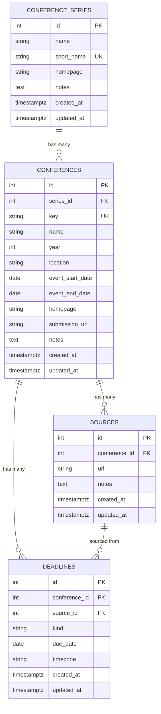

# ConfRadar Schema Design v2 - Enhanced Event Model

## Overview

This document describes the enhanced schema design for ConfRadar that aligns with PRD requirements while maintaining the existing normalized structure.

## Design Principles

1. **Normalized Structure**: Maintain separate tables for conferences, sources, and deadlines
2. **Series Support**: Add conference series tracking for multi-year events
3. **Rich Metadata**: Include all fields from PRD requirements
4. **Backwards Compatibility**: Extend existing schema without breaking changes
5. **Data Integrity**: Enforce constraints at database level

## Schema Changes

### New Table: `conference_series`

Tracks conference series (e.g., NeurIPS as a series that occurs annually).

```sql
CREATE TABLE conference_series (
    id SERIAL PRIMARY KEY,
    name VARCHAR(255) NOT NULL,              -- Full series name (e.g., "Conference on Neural Information Processing Systems")
    short_name VARCHAR(64) NOT NULL,         -- Acronym/short name (e.g., "NeurIPS")
    homepage VARCHAR(512),                   -- Series homepage (may differ from yearly event pages)
    notes TEXT,                              -- Additional metadata about the series
    created_at TIMESTAMPTZ NOT NULL DEFAULT now(),
    updated_at TIMESTAMPTZ NOT NULL DEFAULT now(),
    CONSTRAINT uq_series_short_name UNIQUE (short_name)
);

CREATE INDEX ix_series_name ON conference_series(name);
```

### Enhanced Table: `conferences`

Add fields for year, location, event dates, and link to series.

```sql
ALTER TABLE conferences
    ADD COLUMN series_id INTEGER REFERENCES conference_series(id) ON DELETE SET NULL,
    ADD COLUMN year INTEGER,
    ADD COLUMN location VARCHAR(255),              -- City, Country (e.g., "New Orleans, USA")
    ADD COLUMN event_start_date DATE,             -- Conference start date
    ADD COLUMN event_end_date DATE,               -- Conference end date
    ADD COLUMN submission_url VARCHAR(512),       -- Submission portal URL
    ADD COLUMN notes TEXT;                        -- General notes about the event

-- Index for common queries
CREATE INDEX ix_conference_year ON conferences(year);
CREATE INDEX ix_conference_series ON conferences(series_id);
CREATE INDEX ix_conference_dates ON conferences(event_start_date, event_end_date);

-- Constraint: year should be reasonable (2020-2035 for now)
ALTER TABLE conferences
    ADD CONSTRAINT ck_conference_year CHECK (year IS NULL OR (year >= 2020 AND year <= 2035));
```

### Existing Tables (Unchanged)

- `sources` - No changes, already tracks multiple source URLs per conference
- `deadlines` - No changes, already tracks multiple deadline types with dates and timezones

## Relationships



## Field Mapping: PRD to Schema

| PRD Field | Schema Implementation | Notes |
|-----------|----------------------|-------|
| series_name | `conference_series.name` | New series table |
| short_name | `conference_series.short_name` | Acronym (e.g., "NeurIPS") |
| year | `conferences.year` | Conference year |
| dates | `conferences.event_start_date`, `event_end_date` | Conference event dates |
| location | `conferences.location` | City, Country |
| links | `conferences.homepage`, `submission_url`, `sources.url` | Multiple URLs supported |
| last_updated | `conferences.updated_at`, `deadlines.updated_at` | Automatic timestamps |

## Data Examples

### Conference Series

```json
{
  "id": 1,
  "name": "Conference on Neural Information Processing Systems",
  "short_name": "NeurIPS",
  "homepage": "https://neurips.cc",
  "notes": "Top-tier ML conference, formerly NIPS"
}
```

### Conference Event

```json
{
  "id": 101,
  "series_id": 1,
  "key": "neurips_2025",
  "name": "NeurIPS 2025",
  "year": 2025,
  "location": "Vancouver, Canada",
  "event_start_date": "2025-12-08",
  "event_end_date": "2025-12-14",
  "homepage": "https://neurips.cc/Conferences/2025",
  "submission_url": "https://openreview.net/group?id=NeurIPS.cc/2025/Conference"
}
```

### Deadlines

```json
[
  {
    "conference_id": 101,
    "kind": "abstract",
    "due_date": "2025-05-15",
    "timezone": "AoE"
  },
  {
    "conference_id": 101,
    "kind": "submission",
    "due_date": "2025-05-22",
    "timezone": "AoE"
  },
  {
    "conference_id": 101,
    "kind": "notification",
    "due_date": "2025-09-21",
    "timezone": "AoE"
  }
]
```

## Advantages of This Design

1. **Normalized**: Reduces redundancy (series name not repeated per year)
2. **Flexible**: Can track conferences without series (series_id nullable)
3. **Query-Friendly**: Easy to find all years of a conference series
4. **Change-Tracking**: Timestamps on all tables
5. **Extensible**: Can add more series-level metadata without touching events
6. **Alias-Friendly**: Series table perfect place to store alternative names/acronyms

## Migration Strategy

### Phase 1: Add Series Table (Non-Breaking)

1. Create `conference_series` table
2. Add `series_id` to `conferences` (nullable)
3. No data migration needed yet - existing conferences work as-is

### Phase 2: Add Event Metadata (Non-Breaking)

1. Add `year`, `location`, event dates, `submission_url`, `notes` columns
2. All nullable, so existing rows unaffected
3. New data will populate these fields

### Phase 3: Populate Series (Data Migration)

1. Extract unique conference series from existing `conferences.key` patterns
2. Create series records
3. Update `conferences.series_id` to link events to series
4. Backfill year from key if available

### Phase 4: Constraints (Optional Future)

1. Make `series_id` NOT NULL (after all events linked)
2. Make `year` NOT NULL
3. Add CHECK constraint for event date ordering

## Query Examples

### Find All Events for a Series

```sql
SELECT c.year, c.name, c.location, c.event_start_date
FROM conferences c
JOIN conference_series cs ON c.series_id = cs.id
WHERE cs.short_name = 'NeurIPS'
ORDER BY c.year DESC;
```

### Find Upcoming Conferences

```sql
SELECT cs.short_name, c.year, c.location, c.event_start_date
FROM conferences c
JOIN conference_series cs ON c.series_id = cs.id
WHERE c.event_start_date >= CURRENT_DATE
ORDER BY c.event_start_date ASC
LIMIT 10;
```

### Find Deadlines for 2025 Conferences

```sql
SELECT 
    cs.short_name,
    c.year,
    d.kind,
    d.due_date,
    d.timezone
FROM deadlines d
JOIN conferences c ON d.conference_id = c.id
JOIN conference_series cs ON c.series_id = cs.id
WHERE c.year = 2025 AND d.due_date >= CURRENT_DATE
ORDER BY d.due_date ASC;
```

## Implementation Checklist

- [ ] Create Alembic migration for `conference_series` table
- [ ] Create Alembic migration for `conferences` table alterations
- [ ] Update SQLAlchemy models (`models.py`)
- [ ] Update Data Schema wiki documentation
- [ ] Create seed data for major conference series
- [ ] Update tests to use new schema
- [ ] Update scrapers to populate new fields
- [ ] Verify backwards compatibility

## References

- Original schema: `wiki/Data-Schema.md`
- PRD requirements: `docs/confradar_prd.md`
- Issue #3: Define ConfRadar event schema

---

**Document Status**: Draft - Ready for Review  
**Last Updated**: 2025-02-11  
**Issue**: #3
