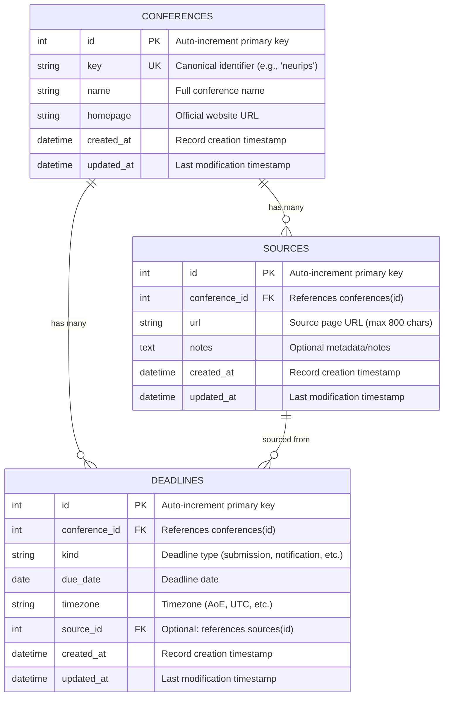

# Data Schema

This document describes the PostgreSQL database schema for ConfRadar, including tables, relationships, indexes, constraints, and design rationale.

## Overview

ConfRadar uses a relational database to store conference information, deadlines, and source URLs. The schema is designed to:

- **Support deduplication**: Each conference has a unique `key` for identity
- **Track multiple sources**: Conferences can be discovered from multiple websites
- **Store multiple deadlines**: Each conference can have several deadline types (submission, notification, camera-ready)
- **Enable change tracking**: Timestamps on all records support detecting updates
- **Maintain referential integrity**: Foreign keys with CASCADE delete for data consistency

## Database Technology

- **DBMS**: PostgreSQL 16
- **ORM**: SQLAlchemy 2.0+ with declarative mappings
- **Migrations**: Alembic for schema versioning
- **Connection**: psycopg 3.x driver
- **Models**: `packages/confradar/src/confradar/db/models.py`
- **Base/engine**: `packages/confradar/src/confradar/db/base.py`
- **Migrations**: `alembic/versions/`

## Entity-Relationship Diagram



## Tables

### `conferences`

Stores core conference information. Each conference is identified by a unique `key` (canonical identifier).

| Column | Type | Constraints | Description |
|--------|------|-------------|-------------|
| `id` | INTEGER | PRIMARY KEY, AUTO_INCREMENT | Unique identifier |
| `key` | VARCHAR(64) | NOT NULL, UNIQUE | Canonical key (e.g., "neurips", "acl_2025") |
| `name` | VARCHAR(255) | NOT NULL | Full conference name |
| `homepage` | VARCHAR(512) | NULL | Official website URL |
| `created_at` | TIMESTAMPTZ | NOT NULL, DEFAULT now() | Record creation time |
| `updated_at` | TIMESTAMPTZ | NOT NULL, DEFAULT now(), ON UPDATE now() | Last update time |

**Indexes:**
- `uq_conference_key` (UNIQUE): Ensures each conference has a unique canonical identifier
- `ix_conference_name`: Speeds up searches by conference name

**Design Notes:**
- `key` is the canonical identifier used for deduplication across sources
- `homepage` is optional as some conferences may not have a stable URL
- Timestamps enable change detection and staleness checks

### `sources`

Tracks source URLs where conference information was discovered. Enables multi-source reconciliation.

| Column | Type | Constraints | Description |
|--------|------|-------------|-------------|
| `id` | INTEGER | PRIMARY KEY, AUTO_INCREMENT | Unique identifier |
| `conference_id` | INTEGER | NOT NULL, FK → conferences(id) ON DELETE CASCADE | Associated conference |
| `url` | VARCHAR(800) | NOT NULL | Source page URL |
| `notes` | TEXT | NULL | Optional metadata (scraper name, date, etc.) |
| `created_at` | TIMESTAMPTZ | NOT NULL, DEFAULT now() | Record creation time |
| `updated_at` | TIMESTAMPTZ | NOT NULL, DEFAULT now(), ON UPDATE now() | Last update time |

**Indexes:**
- `uq_source_conf_url` (UNIQUE): Prevents duplicate source URLs per conference
- `ix_source_url`: Speeds up lookups by source URL

**Foreign Keys:**
- `conference_id` → `conferences.id` with CASCADE delete (if conference deleted, sources are removed)

**Design Notes:**
- Multiple sources per conference enable cross-validation and redundancy
- `notes` field stores scraper metadata for auditing and debugging
- CASCADE delete ensures orphaned sources are cleaned up automatically

### `deadlines`

Stores deadline information for conferences. Each conference can have multiple deadline types.

| Column | Type | Constraints | Description |
|--------|------|-------------|-------------|
| `id` | INTEGER | PRIMARY KEY, AUTO_INCREMENT | Unique identifier |
| `conference_id` | INTEGER | NOT NULL, FK → conferences(id) ON DELETE CASCADE | Associated conference |
| `kind` | VARCHAR(64) | NOT NULL | Deadline type (e.g., "submission", "notification", "camera_ready") |
| `due_date` | DATE | NOT NULL | Deadline date |
| `timezone` | VARCHAR(64) | NULL | Timezone identifier (e.g., "AoE", "UTC", "America/New_York") |
| `source_id` | INTEGER | NULL, FK → sources(id) | Optional: which source provided this deadline |
| `created_at` | TIMESTAMPTZ | NOT NULL, DEFAULT now() | Record creation time |
| `updated_at` | TIMESTAMPTZ | NOT NULL, DEFAULT now(), ON UPDATE now() | Last update time |

**Indexes:**
- `uq_deadline_unique` (UNIQUE): Prevents duplicate deadlines (same conference, kind, and date)
- `ix_deadline_due_date`: Enables efficient sorting and filtering by deadline date

**Foreign Keys:**
- `conference_id` → `conferences.id` with CASCADE delete
- `source_id` → `sources.id` (nullable, allows tracking provenance)

**Design Notes:**
- `kind` values include: submission, abstract, notification, camera_ready, workshop_submission, etc.
- `timezone` is critical for accurate deadline interpretation (especially "AoE" - Anywhere on Earth)
- Composite unique constraint prevents accidental duplicates
- `source_id` enables tracking which source provided each deadline (useful for conflict resolution)

## Timestamp Mixin

All tables inherit from `TimestampMixin`, which provides:

```python
created_at: TIMESTAMPTZ NOT NULL DEFAULT now()
updated_at: TIMESTAMPTZ NOT NULL DEFAULT now() ON UPDATE now()
```

**Benefits:**
- Automatic record creation tracking
- Last-modified timestamps for change detection
- Enables "freshness" queries (e.g., records not updated in 7 days)
- Supports audit trails and debugging

## Relationships

### Conference → Sources (One-to-Many)

- One conference can have multiple source URLs
- Cascade delete: deleting a conference removes all its sources
- Use case: Cross-referencing data from WikiCFP, AI Deadlines, official sites, etc.

### Conference → Deadlines (One-to-Many)

- One conference can have multiple deadlines (different types and dates)
- Cascade delete: deleting a conference removes all its deadlines
- Use case: Tracking submission, notification, and camera-ready deadlines

### Source → Deadlines (One-to-Many, Optional)

- A deadline can optionally reference its source
- Nullable foreign key: deadline can exist without explicit source tracking
- Use case: Provenance tracking for conflict resolution when multiple sources disagree

## Indexes and Performance

### Primary Keys
All tables use auto-increment integer primary keys for:
- Fast joins and lookups
- Small foreign key storage
- Database-managed uniqueness

### Unique Constraints

| Table | Constraint | Purpose |
|-------|-----------|---------|
| `conferences` | `uq_conference_key` | Enforce unique canonical identifier |
| `sources` | `uq_source_conf_url` | Prevent duplicate URLs per conference |
| `deadlines` | `uq_deadline_unique` | Prevent duplicate deadlines (conference + kind + date) |

### Non-Unique Indexes

| Table | Index | Purpose |
|-------|-------|---------|
| `conferences` | `ix_conference_name` | Search conferences by name |
| `sources` | `ix_source_url` | Look up sources by URL |
| `deadlines` | `ix_deadline_due_date` | Sort/filter by deadline date |

**Query Patterns:**
- **Find upcoming deadlines**: `ix_deadline_due_date` + join to conferences
- **Search by conference name**: `ix_conference_name`
- **Check if URL already scraped**: `ix_source_url`
- **Deduplication check**: `uq_conference_key`

## Data Integrity Rules

### Enforced at Database Level

1. **NOT NULL constraints**: Required fields (name, key, due_date, etc.)
2. **Foreign keys with CASCADE**: Automatic cleanup of dependent records
3. **Unique constraints**: Prevent duplicates at schema level
4. **Timestamp defaults**: Automatic timestamping via `func.now()`

### Application-Level Validation (Future)

*To be implemented:*
- Year validation (e.g., 2020-2030 range)
- Deadline ordering (submission < notification < camera_ready)
- URL format validation
- Timezone string validation

## Common Query Examples

### Find All Upcoming Deadlines

```sql
SELECT c.name, c.key, d.kind, d.due_date, d.timezone
FROM deadlines d
JOIN conferences c ON d.conference_id = c.id
WHERE d.due_date >= CURRENT_DATE
ORDER BY d.due_date ASC
LIMIT 20;
```

### Find Conferences Not Updated Recently

```sql
SELECT c.name, c.key, c.updated_at
FROM conferences c
WHERE c.updated_at < NOW() - INTERVAL '7 days'
ORDER BY c.updated_at ASC;
```

### Count Sources Per Conference

```sql
SELECT c.name, COUNT(s.id) as source_count
FROM conferences c
LEFT JOIN sources s ON c.id = s.conference_id
GROUP BY c.id, c.name
ORDER BY source_count DESC;
```

### Find Deadlines with Multiple Sources (Potential Conflicts)

```sql
SELECT c.name, d.kind, d.due_date, COUNT(DISTINCT d.source_id) as source_count
FROM deadlines d
JOIN conferences c ON d.conference_id = c.id
WHERE d.source_id IS NOT NULL
GROUP BY c.name, d.kind, d.due_date
HAVING COUNT(DISTINCT d.source_id) > 1;
```

## ORM Usage with SQLAlchemy

### Conference Model

```python
from confradar.db.models import Conference

# Create conference
conf = Conference(
    key="neurips_2025",
    name="Conference on Neural Information Processing Systems 2025",
    homepage="https://neurips.cc/Conferences/2025"
)

# Access relationships
for source in conf.sources:
    print(source.url)

for deadline in conf.deadlines:
    print(f"{deadline.kind}: {deadline.due_date}")
```

### Deadline Model

```python
from confradar.db.models import Deadline
from datetime import date

# Create deadline
deadline = Deadline(
    conference_id=conf.id,
    kind="submission",
    due_date=date(2025, 5, 15),
    timezone="AoE"
)

# Access parent
print(deadline.conference.name)
```

## Schema Evolution Strategy

### Current Version: v1 (Revision 6734aa7c5266)

Initial schema with core entities (conferences, sources, deadlines).

### Planned Enhancements

**Near-term (M2-M3):**
- Add `year` field to conferences table
- Add `venue` information (city, country)
- Add `event_dates` (start/end dates for conference itself)
- Add `tracks` or `topics` table (many-to-many with conferences)

**Medium-term (M4-M5):**
- Add `conference_series` table (normalize conference families)
- Add `aliases` table (store conference name variations)
- Add `change_log` table (track field-level changes over time)
- Add full-text search indexes on conference names

**Long-term (M6+):**
- Add `workshops` table (related events)
- Add `organizations` table (hosting organizations)
- Add `locations` table (normalize venue data)
- Consider graph database for complex relationships (Neo4j?)

### Migration Best Practices

1. **Always use Alembic**: Never manually alter schema
2. **Test migrations**: Run on copy of production data
3. **Backwards compatibility**: Add nullable columns, backfill, then add NOT NULL
4. **Indexes**: Add concurrently in PostgreSQL (minimize downtime)
5. **Document changes**: Each migration should have clear comments

## Design Rationale

### Why PostgreSQL?

- **Concurrent writes**: Multiple scrapers can write simultaneously
- **Transactions**: ACID guarantees for data integrity
- **JSON support**: Future flexibility for semi-structured data (JSONB columns)
- **Full-text search**: Built-in capabilities for conference name search
- **Scalability**: Handles millions of records efficiently
- **Cloud-ready**: Available as managed service (RDS, Cloud SQL)

### Why This Schema Design?

**Normalization:**
- Tables are in 3NF (Third Normal Form)
- Reduces redundancy (sources and deadlines separate from conferences)
- Enables independent updates (deadline can change without conference record change)

**Denormalization Avoided (For Now):**
- No redundant deadline count in conferences table (can be computed)
- No cached "latest deadline" field (queries are fast enough)
- Premature optimization avoided until proven bottleneck

**Foreign Keys with CASCADE:**
- Simplifies cleanup (no orphaned records)
- Ensures referential integrity at database level
- Trade-off: Cannot recover deleted data without backups

### Alternative Designs Considered

**1. Single ConferenceEvent Table (Rejected)**
- Would combine conference + year + deadlines into one table
- ❌ High redundancy (conference name repeated per year)
- ❌ Difficult to track series-level aliases
- ✅ Simpler queries for single-year events

**2. JSONB for Deadlines (Rejected for MVP)**
- Store all deadlines as JSONB array in conferences table
- ❌ Harder to query individual deadlines
- ❌ Less type safety
- ✅ Faster for bulk retrieval
- *May revisit for read-heavy workloads*

**3. Separate ConferenceSeries Table (Deferred to M4)**
- Normalize series name from yearly events
- ✅ Better represents real-world structure
- ✅ Enables series-level metadata
- ❌ More complex queries
- *Planned for future iteration*

## Migrations (Alembic)

### Apply Migrations

```powershell
# Upgrade to latest schema
uv run alembic upgrade head

# Downgrade one revision
uv run alembic downgrade -1

# View migration history
uv run alembic history
```

### Create New Migrations

```powershell
# Auto-generate migration from model changes
uv run alembic revision --autogenerate -m "add year field to conferences"

# Create empty migration for custom SQL
uv run alembic revision -m "add custom constraints"
```

### Migration Testing

```bash
# Test upgrade
uv run alembic upgrade head

# Test downgrade
uv run alembic downgrade base

# Reapply
uv run alembic upgrade head
```

## Monitoring and Maintenance

### Key Metrics to Monitor

```sql
-- Table sizes
SELECT 
    schemaname, 
    tablename, 
    pg_size_pretty(pg_total_relation_size(schemaname||'.'||tablename)) AS size
FROM pg_tables 
WHERE schemaname = 'public' 
ORDER BY pg_total_relation_size(schemaname||'.'||tablename) DESC;

-- Index usage
SELECT * FROM pg_stat_user_indexes;

-- Slow queries (requires pg_stat_statements extension)
SELECT * FROM pg_stat_statements ORDER BY total_exec_time DESC LIMIT 10;
```

### Maintenance Tasks

- **Weekly**: Check for unused indexes
- **Monthly**: Review query performance with `EXPLAIN ANALYZE`
- **Quarterly**: Evaluate schema changes based on usage patterns
- **Annually**: Review backup/restore procedures

## References

- SQLAlchemy 2.0 Documentation: https://docs.sqlalchemy.org/en/20/
- PostgreSQL Documentation: https://www.postgresql.org/docs/16/
- Alembic Documentation: https://alembic.sqlalchemy.org/
- Database Normalization: https://en.wikipedia.org/wiki/Database_normalization

## Change Log

| Date | Version | Changes | Migration |
|------|---------|---------|-----------|
| 2025-10-25 | v1 (6734aa7c5266) | Initial schema: conferences, sources, deadlines | Initial |
| 2025-10-26 | v1 | Migrated to PostgreSQL from SQLite | #75 |
| 2025-10-26 | v1 | Comprehensive documentation created | #59 |

---

**Document Status**: Complete  
**Last Updated**: 2025-10-26  
**Maintained By**: ConfRadar Team
